# Course Discovery Architecture

## Scope

This document describes the runtime architecture, major components, data stores, integrations, and key interaction flows for Course Discovery. It is derived from the Django URL configuration, DRF viewsets, domain models, search index code, Celery tasks, management commands, and existing repository documentation.

Course Discovery is the Open edX metadata aggregation and catalog service. It consolidates course, course run, program, catalog, organization, people, pathway, taxonomy, and commerce-facing metadata from multiple systems and exposes it through REST APIs, search indexes, admin tools, and operational jobs.

## Architectural Summary

Course Discovery is a Django service with DRF APIs at the edge, relational domain storage as the source of truth, Elasticsearch as the query/search projection, Celery for asynchronous jobs, and management commands for batch ingestion and operational maintenance.

The core architectural pattern is a metadata hub:

- Upstream systems provide course, run, program, ecommerce, analytics, LMS, and marketing metadata.
- Discovery normalizes the metadata into domain models under `course_metadata`, `catalogs`, `learner_pathway`, `taxonomy_support`, `tagging`, `publisher`, and `core` apps.
- Search index documents project selected data into Elasticsearch for search, facets, typeahead, and catalog membership queries.
- API consumers, Publisher, affiliate feeds, and downstream services read or mutate metadata through REST endpoints.
- Signals, tasks, commands, and integration utilities synchronize selected changes to Studio, Salesforce, Drupal, LMS, and search indexes.

## System Context

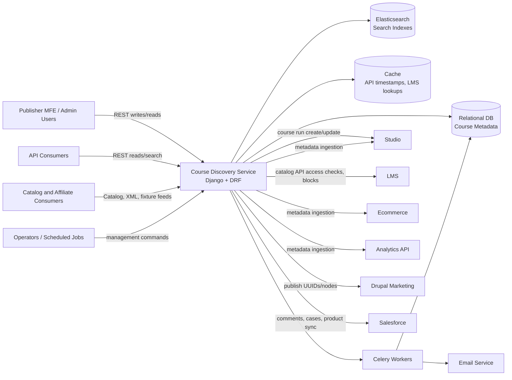

## Container View

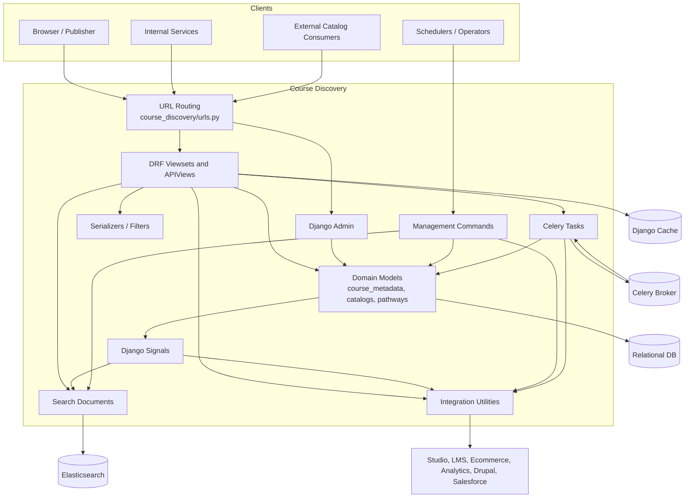

## Logical Components

| Component | Responsibility | Primary code anchors |
| --- | --- | --- |
| API edge | Routes HTTP traffic to REST APIs, admin, schema docs, Publisher APIs, taxonomy APIs, learner pathway APIs, and optional extensions. | `course_discovery/urls.py`, `course_discovery/apps/api/**/urls.py`, `course_discovery/apps/publisher/api/urls.py` |
| Core metadata domain | Owns canonical course, course run, program, degree, organization, people, pricing, restriction, and review metadata. | `course_discovery/apps/course_metadata/models.py` |
| Catalog domain | Defines dynamic catalogs using Elasticsearch query strings and viewer permissions. | `course_discovery/apps/catalogs/models.py`, `CatalogViewSet` |
| Search projection | Maintains Elasticsearch documents for courses, course runs, programs, people, and learner pathways. | `course_discovery/apps/course_metadata/search_indexes/` |
| Publisher support | Supports Publisher authoring, organization roles, comments, course editors, reviews, and draft/live workflows. | `course_discovery/apps/publisher/`, `course_discovery/apps/api/v1/views/courses.py`, `course_runs.py` |
| Taxonomy and pathways | Stores subjects, topics, verticals, recommendations, and structured learner pathways. | `taxonomy_support`, `tagging`, `learner_pathway` apps |
| Integration layer | Encapsulates calls to Studio, LMS, Salesforce, Drupal, and partner API endpoints. | `StudioAPI`, `LMSAPIClient`, `salesforce.py`, `publishers.py`, data loaders |
| Batch operations | Runs imports, refreshes, indexing, publishing, backfills, archiving, and data repair. | management commands under `course_discovery/apps/**/management/commands/` |
| Async operations | Processes bulk uploads, enterprise inclusion propagation, and deadline email jobs. | `course_discovery/apps/course_metadata/tasks.py`, `course_discovery/celery.py` |

## Data Architecture

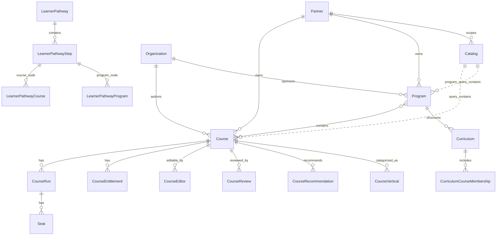

The relational database remains the canonical store. Elasticsearch is a derived projection that supports search, facets, typeahead, aggregate search, and catalog query membership. Cache entries are used for API response timestamping and selected external lookups, such as LMS catalog API access checks and block metadata.

## Runtime Flow Overview

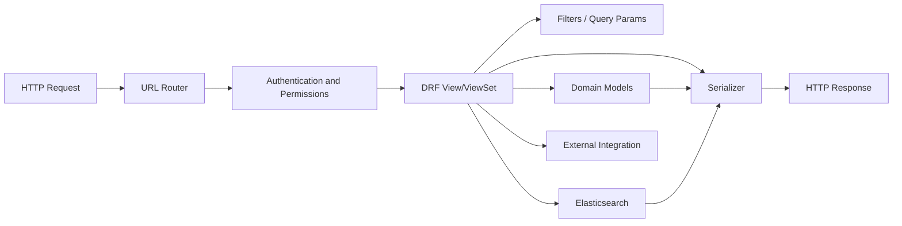

## Key Design Decisions Observed

- Discovery separates reusable `Course` identity from scheduled `CourseRun` offerings.
- Course and course run write flows use draft records and publish/update official versions only at defined transition points.
- Public read flows are partner-scoped through `request.site.partner`.
- Public product responses exclude restricted run types unless explicitly included by query parameter.
- Catalogs are query-defined instead of static membership lists.
- Search and catalog membership depend on Elasticsearch projections, not only relational queries.
- Data loaders and search index commands are operationally important and should be treated as architecture entry points, not incidental scripts.
- Signals synchronize selected model changes to Salesforce and Elasticsearch, but with business gates such as draft and marketability checks.

## Sequence Diagrams

### 1. Authenticated API Read

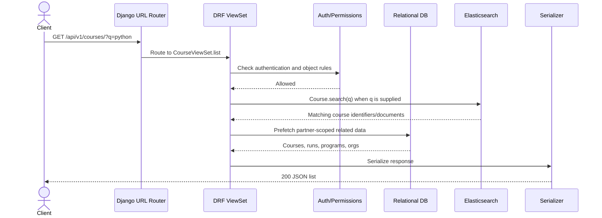

### 2. Course Creation With Optional Initial Run

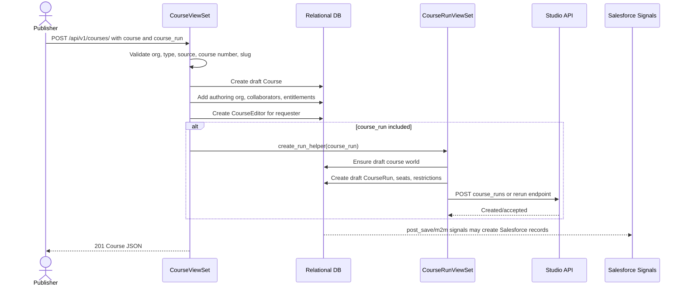

### 3. Course Run Update And Review Transition

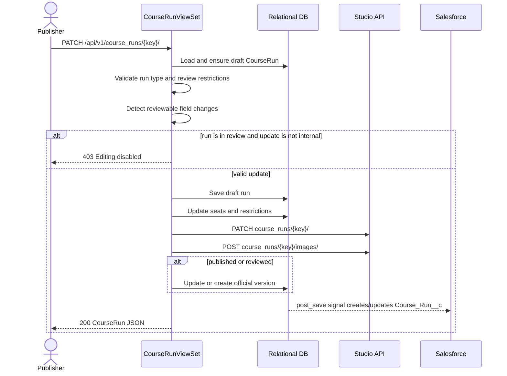

### 4. Search Request

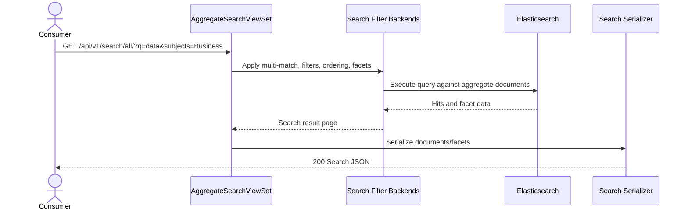

### 5. Catalog Membership Check

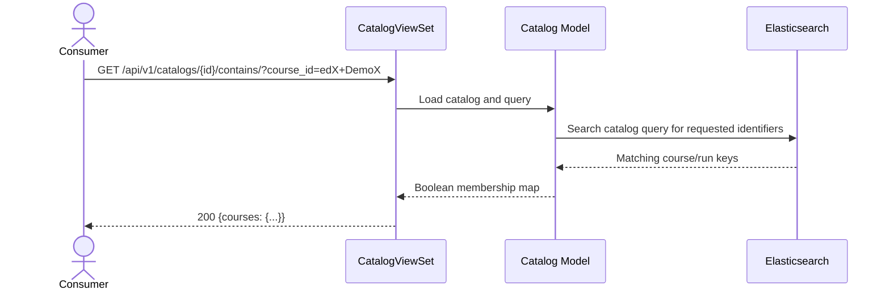

### 6. Catalog Courses With LMS Access Check

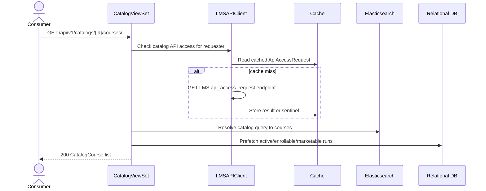

### 7. Metadata Refresh Pipeline

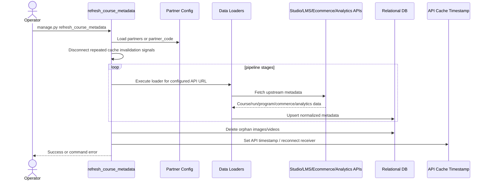

### 8. Bulk Operation Task Processing

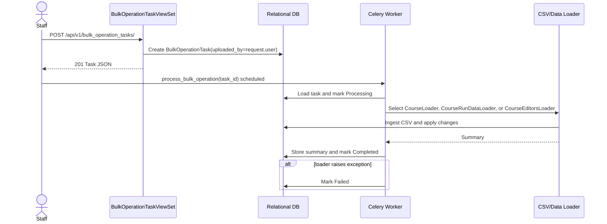

### 9. Elasticsearch Index Update

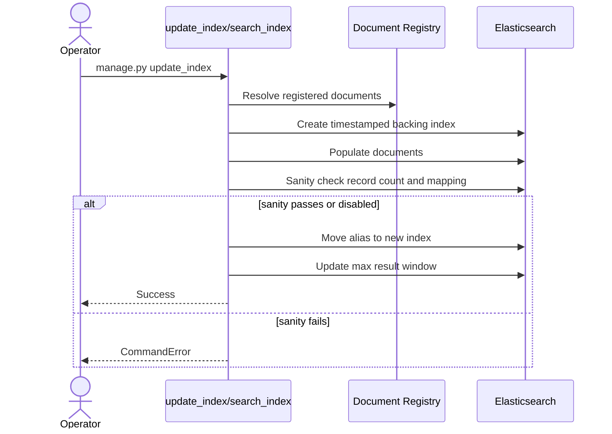

### 10. Real-Time Search Projection Update

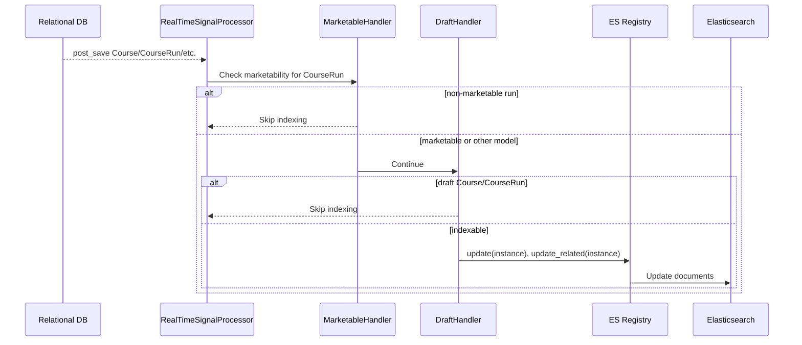

### 11. Salesforce Synchronization

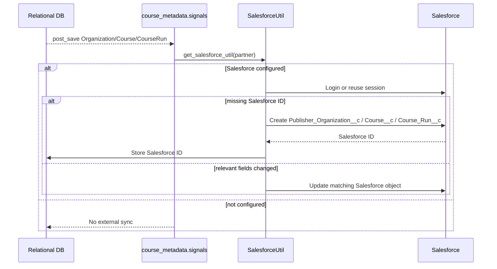

### 12. Publisher Comment Flow

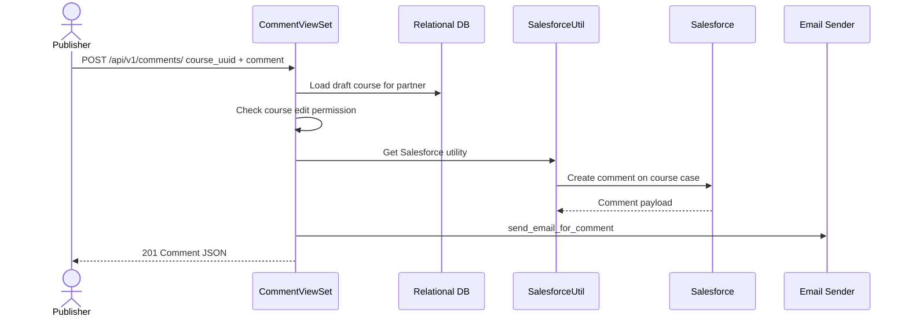

## API Surface

Discovery exposes these REST endpoint groups:

- Core API: `/api/v1/*` and `/api/v2/*`.
- Learner pathway API: mounted under `/api/v1/learner-pathway*`.
- Publisher API: `/publisher/api/admins/organizations/*`.
- Taxonomy API: `/taxonomy/api/v1/course_recommendations/*`.
- Optional catalog extension API: `/extensions/api/v1/*` when the extension app is installed.
- Admin and schema UI: `/admin/` and `/api-docs/`.

See `specs/openapi.yaml` for the generated route inventory.

## Integration Architecture

| Integration | Direction | Mechanism | Usage |
| --- | --- | --- | --- |
| Studio | Outbound | OAuth API client via `StudioAPI` | Create/rerun/update course runs and course run images. |
| LMS | Outbound | `LMSAPIClient` | Catalog API access checks, course block data, translations/transcriptions. |
| Ecommerce | Inbound pull | Data loader APIs | Load commerce and seat metadata into Discovery. |
| Analytics | Inbound pull | Data loader APIs | Load analytics-enriched metadata. |
| Drupal | Outbound | Publisher utilities and management commands | Publish marketing nodes and UUIDs. |
| Salesforce | Outbound | Signals and `SalesforceUtil` | Sync publisher organizations, courses, course runs, cases, and comments. |
| Elasticsearch | Bidirectional projection/query | django-elasticsearch-dsl documents and DRF search viewsets | Search, facets, typeahead, catalog query membership. |
| Email | Outbound | Celery task and email helpers | Course deadline and comment notifications. |

## Deployment And Runtime Concerns

- The web process serves Django, DRF, Swagger UI, admin, static/media in development, and optional extension routes.
- Celery workers discover tasks from installed Django apps through `course_discovery/celery.py`.
- Operators rely on management commands for data refresh, search index maintenance, backfills, archiving, external publishing, and CSV imports.
- Partner configuration controls external API URLs such as LMS, Studio, Ecommerce, Programs, Courses, Analytics, Publisher, and Salesforce.
- Elasticsearch index updates use alias switching and sanity checks to reduce the risk of pointing search traffic at an incomplete index.
- API response cache invalidation is intentionally suppressed during metadata refresh and restored after the pipeline completes to avoid repeated churn.

## Quality Attributes

| Attribute | Architectural support |
| --- | --- |
| Availability | Read APIs can serve from relational data and Elasticsearch projections; index aliases support safer search rebuilds. |
| Performance | Search and catalog membership use Elasticsearch; serializers prefetch related data; cache stores API timestamps and LMS lookup results. |
| Consistency | Relational models are canonical; draft/live separation controls publishing; search is eventually consistent through signals and commands. |
| Operability | Management commands cover refresh, indexing, archiving, publishing, backfills, and data repair. |
| Security | Primary API surfaces require authentication; edit flows use staff, Publisher, object-level, and course-editor permissions. |
| Extensibility | Data loader framework, optional catalog extension app, DRF routers, and search document registrations allow additional surfaces. |

## Architectural Risks And Notes

- Search and catalog behavior depends on Elasticsearch index freshness. Draft and non-marketable product changes may intentionally not appear in indexes.
- Signals create side effects to Salesforce and search projections; failures can be operationally subtle if logs are not monitored.
- Some workflows use management commands rather than API endpoints, so production behavior depends on scheduler and operator discipline.
- OpenAPI route coverage is generated manually from code in `specs/openapi.yaml`; schema-level request/response shapes remain generic because many serializers are dynamic and context-sensitive.
- Course and course run write flows rely on draft/live semantics. Changes that bypass those flows can break Publisher review expectations.

## Source Evidence

- `docs/introduction.rst` describes Discovery as a data aggregator for Studio, LMS, Ecommerce, Drupal, search, catalogs, and programs.
- `course_discovery/urls.py` defines the service entry points, API docs, admin, publisher, taxonomy, learner pathway, tagging, and optional extension routes.
- `course_discovery/apps/course_metadata/models.py` contains the central metadata domain.
- `course_discovery/apps/api/v1/views/courses.py` and `course_runs.py` implement draft/live write flows and Studio pushes.
- `course_discovery/apps/catalogs/models.py` and `course_discovery/apps/api/v1/views/catalogs.py` implement query-defined catalogs.
- `course_discovery/apps/course_metadata/search_indexes/` and `course_discovery/apps/edx_elasticsearch_dsl_extensions/` implement search projections and index update behavior.
- `course_discovery/apps/course_metadata/tasks.py` defines Celery-backed bulk operations and email tasks.
- `course_discovery/apps/course_metadata/management/commands/refresh_course_metadata.py` defines the staged metadata refresh pipeline.
- `course_discovery/apps/course_metadata/signals.py` and `salesforce.py` implement Salesforce synchronization.
- `course_discovery/apps/api/utils.py` and `course_discovery/apps/core/api_client/lms.py` implement Studio and LMS integration helpers.