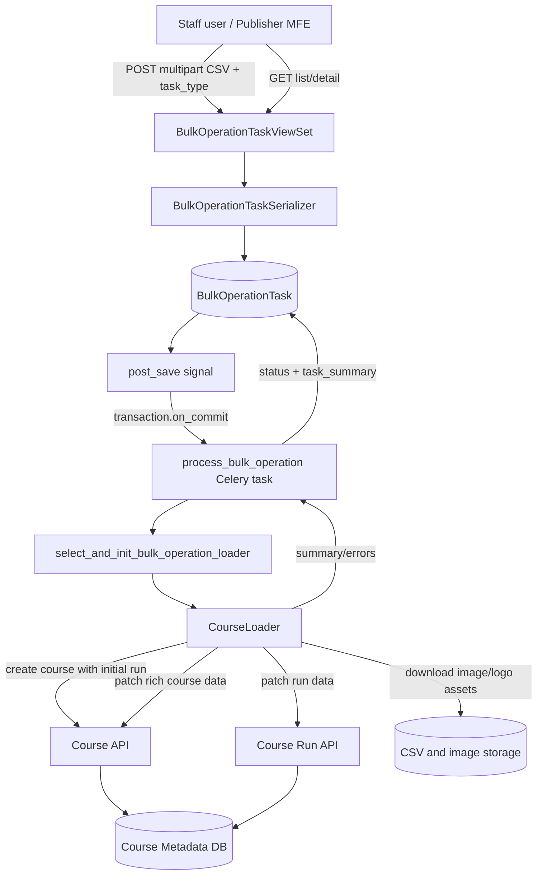

# Course Bulk Operations: Course Creation SDD

## Document Status

Status: Existing implementation

Repository: `course-discovery`

Primary feature: CSV-based bulk course creation through `BulkOperationTask` records and asynchronous Celery processing.

Primary code anchors:

- `course_discovery/apps/api/v1/views/bulk_operation_tasks.py`
- `course_discovery/apps/api/serializers.py`
- `course_discovery/apps/course_metadata/models.py`
- `course_discovery/apps/course_metadata/signals.py`
- `course_discovery/apps/course_metadata/tasks.py`
- `course_discovery/apps/course_metadata/data_loaders/course_loader.py`
- `course_discovery/apps/course_metadata/data_loaders/mixins.py`

## 1. Purpose

Bulk course creation allows staff users to upload a CSV file that describes one or more courses and initial course runs. Course Discovery stores the upload as a `BulkOperationTask`, queues asynchronous processing, validates each row, creates missing courses through the existing Course API, enriches the resulting course and course run, and stores a machine-readable task summary for later review.

The design reuses the same Course and Course Run API paths used elsewhere in Discovery rather than writing all product fields directly through model saves. This keeps course creation behavior aligned with existing validation, draft handling, entitlement, pricing, and course run creation logic.

## 2. Scope

In scope:

- Creating a bulk operation task by uploading a CSV file.
- Processing `course_create` tasks asynchronously.
- Validating course creation CSV rows.
- Creating a course and initial course run.
- Updating rich course and course run metadata after creation.
- Reading optional `b2c_subscription_inclusion` values from course create and partial update CSVs.
- Downloading course image and organization logo assets.
- Moving eligible course runs to Legal Review when requested.
- Capturing summary and error output on the bulk operation task.
- Listing and retrieving bulk operation tasks through the API.

Out of scope:

- Bulk partial updates, course reruns, and course editor updates except where they share the same task framework.
- Frontend rendering details beyond the API behavior required by the Publisher MFE.
- CSV template generation.
- Retry orchestration or resumable row-level processing.
- Automatic partial completion status calculation.

## 3. Actors

| Actor | Responsibility |
| --- | --- |
| Staff user | Uploads CSV files and reviews task status/results. |
| Publisher MFE | Presents upload, history, and detail screens for bulk operations. |
| Course Discovery API | Accepts task creation, stores uploads, exposes task history and detail. |
| Django signal handler | Queues Celery work after transaction commit. |
| Celery worker | Executes the selected bulk operation loader. |
| CourseLoader | Parses, validates, creates, updates, and summarizes course rows. |
| Course and Course Run APIs | Create and update canonical draft product records. |
| Database and file storage | Persist task metadata, CSV uploads, product records, and downloaded images. |

## 4. User Flow

1. A staff user opens the Bulk Operations screen in Publisher.
2. The user selects `course_create` / Bulk Create and uploads a CSV file.
3. Publisher submits a multipart request to `POST /api/v1/bulk_operation_tasks/`.
4. Course Discovery creates a `BulkOperationTask` with status `pending` and associates it with the uploading user.
5. A post-save signal schedules `process_bulk_operation` after the database transaction commits.
6. The Celery task changes task status to `processing`, selects `CourseLoader`, and calls `ingest()`.
7. `CourseLoader` processes each CSV row independently.
8. On completion, the Celery task writes `task_summary` and changes status to `completed`.
9. If loader execution raises an unhandled exception, the Celery task changes status to `failed` and re-raises the exception.
10. Users can list tasks or retrieve one task to review status, summary, upload URL, and optional Celery result data.

## 5. API Design

### 5.1 Create Bulk Operation Task

Endpoint: `POST /api/v1/bulk_operation_tasks/`

Authentication and authorization:

- Requires authenticated access.
- Requires staff or superuser permissions through `IsStaffOrSuperuser`.

Request format:

- Multipart form data.
- Required fields:
  - `csv_file`: CSV upload. File extension must be `.csv`.
  - `task_type`: `course_create` for bulk course creation.
- `status` may be supplied by clients, but the model default is `pending`.

Response behavior:

- Returns HTTP 201 when the task record is created.
- `uploaded_by` is set from the current request user in `perform_create`.
- The serialized `uploaded_by` field is the username, not a user object.
- `task_id` is read-only and populated when the signal queues Celery work.

### 5.2 List Bulk Operation Tasks

Endpoint: `GET /api/v1/bulk_operation_tasks/`

Behavior:

- Returns paginated task records.
- Default ordering is newest first by `created`.
- Supports ordering by `created` and `status`.
- Supports filtering by `status`.

### 5.3 Retrieve Bulk Operation Task

Endpoint: `GET /api/v1/bulk_operation_tasks/{id}/`

Behavior:

- Returns task metadata, upload URL, task type, status, task id, task summary, timestamps, and uploader username.
- Supports `include_result=true` to include the corresponding `django_celery_results.models.TaskResult.result` value when available.
- Returns `result: null` when `include_result=true` is supplied but no Celery result exists.
- Returns `result: null` by default when `include_result` is omitted or false.

## 6. Data Model

### 6.1 BulkOperationTask

`BulkOperationTask` stores the request and processing state for one uploaded CSV.

| Field | Type | Behavior |
| --- | --- | --- |
| `csv_file` | FileField | Required CSV file. Stored under `bulk_operations/uploads/{uuid}/{filename}`. File extension validator allows `csv`. |
| `uploaded_by` | User FK | User who uploaded the file. Required by model save unless already set. |
| `task_summary` | JSONField | Loader output written after successful processing. |
| `task_type` | CharField | Operation selector. For course creation, value is `course_create`. |
| `status` | CharField | Defaults to `pending`; task processing currently sets `processing`, `completed`, or `failed`. |
| `task_id` | CharField | Celery task identifier, unique, nullable, read-only through serializer. |

### 6.2 Bulk Operation Types

| Value | Label | Loader |
| --- | --- | --- |
| `course_create` | Course Create | `CourseLoader` |
| `partial_updates` | Partial Update | `CourseLoader` |
| `course_rerun` | Course Rerun | `CourseRunDataLoader` |
| `course_editor_update` | Course Editor Update | `CourseEditorsLoader` |

### 6.3 Status Values

Defined statuses are:

- `pending`
- `verified`
- `processing`
- `completed`
- `failed`
- `partially_completed`
- `errored`

Current course creation task execution uses `pending`, `processing`, `completed`, and `failed`. Row-level failures are stored in `task_summary.errors`; they do not currently cause `partially_completed` or `errored` status by themselves.

## 7. Runtime Architecture



## 8. Processing Design

### 8.1 Task Selection

`process_bulk_operation` retrieves the `BulkOperationTask` and calls `select_and_init_bulk_operation_loader`.

For `course_create`, the selector constructs:

- `CourseLoader(partner, csv_file=bulk_operation_task.csv_file, product_source='edx', task_type='course_create')`
- `partner` is loaded by `settings.DEFAULT_PARTNER_ID`.
- `product_source` is currently fixed to `edx`.

### 8.2 CSV Reader Initialization

`CourseLoader` accepts either a CSV path or file-like object. For uploaded bulk operation files, it reads `bulk_operation_task.csv_file` through `unicodecsv.DictReader` and materializes all rows as a list.

Each row is normalized before processing:

- Header names are stripped.
- Header names are converted to lowercase.
- Spaces in header names become underscores.

Example: `Enrollment Track` becomes `enrollment_track`.

### 8.3 Required Course Creation Columns

Base required columns for course creation are:

- `organization`
- `title`
- `number`
- `start_date`
- `end_date`
- `course_pacing`

Course creation also expects enrollment track columns for type lookup:

- `course_enrollment_track`
- `course_run_enrollment_track`

Optional course-level subscription columns:

- `enterprise_subscription_inclusion`
- `b2c_subscription_inclusion`

`verified_price` is required unless the course type is audit-only.

When `move_to_legal_review` is `true`, additional fields are required before processing legal review movement:

Course fields:

- `image`
- `long_description`
- `short_description`
- `what_will_you_learn`
- `level_type`
- `primary_subject`

Course run fields:

- `publish_date`
- `minimum_effort`
- `maximum_effort`
- `length`

For Masters courses, `long_description`, `short_description`, and `what_will_you_learn` are removed from the legal review required field set.

### 8.4 Row Validation

For each row, `CourseLoader` validates:

1. The organization exists by key.
2. The course enrollment track maps to an existing `CourseType`.
3. The course run enrollment track maps to an existing `CourseRunType`.
4. Required fields for the task type and course type are present.
5. Legal review fields are present when legal review movement is requested.

Validation failures are registered in `error_logs`, increment `failure_count`, and skip the row. The loader continues with later rows.

### 8.5 Course Creation Step

For a valid row, the loader derives the course key as:

```text
{organization}+{number}
```

The loader checks for an existing draft course for the same partner and key:

- If one exists, creation is skipped and an informational message is appended to `summary.others`.
- If one does not exist, the loader calls `create_course()`.

`create_course()` builds a request for `POST {DISCOVERY_BASE_URL}/api/v1/courses/` containing:

- `org`
- `title`
- `number`
- `product_source`
- `type`
- `prices`
- nested `course_run` data
- optional `b2c_subscription_inclusion`

Nested initial course run fields include:

- `pacing_type`
- `start`
- `end`
- `run_type`
- `prices`

Start and end datetimes are parsed and serialized in Discovery API datetime format. Missing `start_time` and `end_time` default to `00:00:00` in course creation request data.

Pricing is built from the selected course type's entitlement types and the row's `verified_price`.

When `b2c_subscription_inclusion` is present in the CSV, the loader parses it as a boolean and sends it in the initial Course API create request so the value is inserted into the `course_metadata_course` row. The same value is also included in the post-creation course update payload.

### 8.6 Post-Creation Enrichment

After creation or duplicate detection, the loader reloads:

- the draft course by course key and partner
- the first draft course run for that course

It then computes the draft flag:

- `draft` is true unless any draft course run for the course is already published.

The loader attempts image downloads before updating rich metadata:

- `image` downloads to the course image field.
- `organization_logo_override` downloads to the organization logo override field.
- Image requests use a browser-like user agent header.
- A failed image or logo download logs an error and skips remaining work for that row.

### 8.7 Course Update Step

The loader calls `PATCH {DISCOVERY_BASE_URL}/api/v1/courses/{course.uuid}/?exclude_utm=1` with rich course metadata.

Update payload fields include:

- `draft`
- `key`
- `uuid`
- `url_slug`
- `type`
- `subjects`
- `collaborators`
- `prices`
- `title`
- `syllabus_raw`
- `level_type`
- `outcome`
- `faq`
- `video`
- `prerequisites_raw`
- `full_description`
- `short_description`
- `learner_testimonials`
- `additional_information`
- `organization_short_code_override`
- `watchers`
- `topics`
- optional `enterprise_subscription_inclusion`
- optional `b2c_subscription_inclusion`

Subject names are resolved to subject slugs through English subject translations. Collaborator names are stripped, deduplicated, loaded in bulk, and created if missing.

### 8.8 Course Run Update Step

The loader calls `PATCH {DISCOVERY_BASE_URL}/api/v1/course_runs/{course_run.key}/?exclude_utm=1`.

Update payload fields include:

- `run_type`
- `key`
- `prices`
- `staff`
- `draft`
- `content_language`
- `expected_program_name`
- `transcript_languages`
- `go_live_date`
- `expected_program_type`
- `upgrade_deadline_override`
- `weeks_to_complete`
- `min_effort`
- `max_effort`
- `start`
- `end`
- `enrollment_start`
- `enrollment_end`

Staff values must be valid UUIDs and must refer to `Person` records for the current partner. Content and transcript language values are resolved through `LanguageTag` by name or code and default to `en-us` when omitted.

### 8.9 Legal Review Movement

If all of the following are true, the loader moves the course run to Legal Review:

- The course run status is `Unpublished`.
- `move_to_legal_review` is present.
- `move_to_legal_review.lower() == 'true'`.

The status is set to `LegalReview`, and the course run is saved with `send_emails=True`. This is required so URL slug generation follows the expected subdirectory format.

### 8.10 Summary Output

The loader returns:

```json
{
  "summary": {
    "total_products_count": 0,
    "success_count": 0,
    "failure_count": 0,
    "updated_products_count": 0,
    "created_products": [],
    "others": []
  },
  "errors": {
    "MISSING_ORGANIZATION": [],
    "MISSING_COURSE_TYPE": [],
    "MISSING_COURSE_RUN_TYPE": [],
    "MISSING_REQUIRED_DATA": [],
    "IMAGE_DOWNLOAD_FAILURE": [],
    "LOGO_IMAGE_DOWNLOAD_FAILURE": [],
    "COURSE_CREATE_ERROR": [],
    "COURSE_UPDATE_ERROR": [],
    "COURSE_RUN_UPDATE_ERROR": []
  }
}
```

`total_products_count` is initialized from the number of CSV rows. `success_count` increments after course creation/enrichment succeeds. `failure_count` increments whenever `register_ingestion_error()` is called. `created_products` stores strings containing the course UUID, title, and key. `others` stores non-error informational outcomes such as duplicate course skips.

## 9. Error Handling

### 9.1 Row-Level Errors

Row-level errors are logged, stored in the loader's `errors` output, and do not stop the entire file. Common row-level errors include:

| Error key | Cause |
| --- | --- |
| `MISSING_ORGANIZATION` | `organization` does not match an existing organization key. |
| `MISSING_COURSE_TYPE` | `course_enrollment_track` does not match a `CourseType`. |
| `MISSING_COURSE_RUN_TYPE` | `course_run_enrollment_track` does not match a `CourseRunType`. |
| `MISSING_REQUIRED_DATA` | Required CSV fields are blank or missing. |
| `IMAGE_DOWNLOAD_FAILURE` | Course image download failed. |
| `LOGO_IMAGE_DOWNLOAD_FAILURE` | Organization logo override download failed. |
| `COURSE_CREATE_ERROR` | Course API creation failed. |
| `COURSE_UPDATE_ERROR` | Course API update failed. |
| `COURSE_RUN_UPDATE_ERROR` | Course run API update or legal review save failed. |

### 9.2 Task-Level Errors

If `process_bulk_operation` catches an exception that escapes the loader:

1. It logs the exception.
2. It sets task status to `failed`.
3. It saves the task.
4. It re-raises the exception so Celery records task failure.

Task-level failure prevents `task_summary` from being updated with normal loader output.

## 10. Security and Permissions

- Only staff or superuser API users can create, list, or retrieve bulk operation tasks.
- Uploaded files are constrained by extension to CSV.
- `uploaded_by` is controlled server-side by the authenticated request user.
- `task_id` is read-only through the serializer.
- Course and course run mutations are performed through the existing authenticated internal API client configured for data loaders.
- CSV contents are trusted only after row-level validation. However, the current implementation still processes uploaded text as operational input, so operators should treat CSV templates and upload access as privileged.

## 11. Observability

Current observability channels:

- Django logs record task scheduling, loader startup, row processing, draft flag decisions, API failures, and summarized ingestion errors.
- `BulkOperationTask.status` exposes high-level lifecycle state.
- `BulkOperationTask.task_summary` stores row-level summary and error details.
- `BulkOperationTask.task_id` links the model record to Celery execution.
- Optional `include_result=true` exposes persisted Celery result text when django-celery-results has a matching `TaskResult`.

## 12. Testing Coverage

Existing tests cover:

- Task creation assigns `uploaded_by` from the request user.
- Uploaded file must be a CSV.
- Authentication is required.
- Staff/superuser permission is required.
- Required API fields are enforced.
- Task list supports status filtering and created/status ordering.
- Detail responses serialize `uploaded_by` as username.
- Detail responses can include optional Celery result data.
- Creating a `BulkOperationTask` queues Celery work after creation.
- `process_bulk_operation` selects the correct loader for `course_create`.
- Successful loader execution stores `task_summary` and status `completed`.
- Loader exceptions set task status to `failed`.

Recommended additional coverage:

- End-to-end `course_create` loader tests for a valid CSV row.
- Row-level validation tests for required fields and legal review fields.
- Duplicate course behavior and `summary.others` output.
- Image download failure behavior.
- Course run Legal Review movement.
- Staff UUID and language tag validation behavior.
- Status semantics for mixed success/failure CSV files.

## 13. Key Design Decisions

### 13.1 Use a Persisted Task Model

A `BulkOperationTask` record gives the frontend a durable object to list and poll. It also stores the original CSV file, uploader, processing status, Celery task id, and final summary.

### 13.2 Queue Work After Transaction Commit

The post-save signal uses `transaction.on_commit` so the Celery worker cannot pick up a task before the task row and file reference are committed.

### 13.3 Reuse Course and Course Run APIs

The loader creates and updates products through existing API endpoints. This centralizes validation and side effects in established API behavior instead of duplicating course creation logic inside the loader.

### 13.4 Continue After Row-Level Failures

Bulk creation is best-effort per row. Validation and recoverable processing errors are accumulated into `errors`, while later rows continue processing.

### 13.5 Separate Initial Creation From Enrichment

The loader first creates the minimal course and initial course run, then patches richer course and run fields. This matches the shape of the Course API create contract and keeps the enrichment payloads reusable with partial update behavior.

## 14. Current Limitations

- Uploaded CSV rows are fully materialized in memory before processing.
- Processing is sequential for course creation rows.
- The task status is `completed` when the loader returns, even if some rows failed and `failure_count` is greater than zero.
- Defined statuses such as `partially_completed`, `verified`, and `errored` are not currently used by course creation processing.
- `product_source` is fixed to `edx` in bulk task loader selection.
- `partner` is fixed by `settings.DEFAULT_PARTNER_ID`.
- Duplicate courses are counted in `others` but do not increment `failure_count`.
- There is no built-in row-level retry or resume marker.
- CSV schema is implicit in loader code rather than published as a formal machine-readable schema.

## 15. Compatibility Notes

- Header normalization makes CSV column capitalization and spaces flexible.
- The API currently supports all `BulkOperationType` choices, but this SDD focuses on `course_create`.
- Existing Publisher usage labels `course_create` as Bulk Create and sends it through the same `bulk_operation_tasks` endpoint.
- The uploaded CSV remains available through the `csv_file` URL returned by the task API.

## 16. Acceptance Criteria

### Task Creation

- Given a staff user uploads a `.csv` file with `task_type=course_create`, the API creates a `BulkOperationTask` and returns HTTP 201.
- Given a non-staff user submits a bulk operation task, the API returns HTTP 403.
- Given an unauthenticated user requests the endpoint, the API returns HTTP 401.
- Given a non-CSV file, the API returns HTTP 400 with a `csv_file` error.
- Given a missing `csv_file` or `task_type`, the API returns HTTP 400.

### Task Processing

- Given a created task, a Celery task is queued after transaction commit.
- Given `task_type=course_create`, the task processor instantiates `CourseLoader`.
- Given loader execution succeeds, task status becomes `completed` and `task_summary` contains loader output.
- Given loader execution raises, task status becomes `failed` and the exception is recorded by Celery.

### Course Creation Rows

- Given an unknown organization, the row is skipped and `MISSING_ORGANIZATION` is recorded.
- Given an unknown course type, the row is skipped and `MISSING_COURSE_TYPE` is recorded.
- Given an unknown course run type, the row is skipped and `MISSING_COURSE_RUN_TYPE` is recorded.
- Given missing required data, the row is skipped and `MISSING_REQUIRED_DATA` is recorded.
- Given an existing draft course for the derived key and partner, creation is skipped and an informational `others` entry is added.
- Given valid row data for a new course, the system creates the course, creates the initial course run, patches rich metadata, patches course run metadata, and increments `success_count`.
- Given `move_to_legal_review=true` and an unpublished course run with required legal review fields, the system moves the run to Legal Review.
- Given `b2c_subscription_inclusion` is present in a course create or partial update CSV, the system parses the value as a boolean and patches it onto the course.
- Given `b2c_subscription_inclusion` is blank or omitted, the system leaves the course value unchanged during partial update.

## 17. Open Questions

- Should mixed row outcomes set task status to `partially_completed` instead of `completed`?
- Should `product_source` and `partner` be request-controlled or continue to be server-selected?
- Should the CSV schema be exported as a downloadable template or machine-readable schema?
- Should task detail include parsed summary fields optimized for frontend display?
- Should processing support row-level retry, cancellation, or resume semantics?
